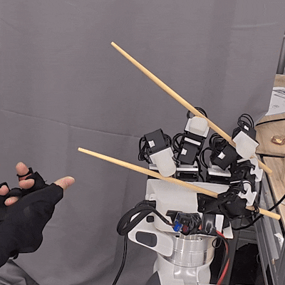

# TipMatch: Cartesian Mapping-Based Retargeting for Dexterous Hand Teleoperation in Tool Manipulation

<!--  -->

 

 
<i>TipMatch achieving precise control in a challenging chopsticks manipulation task.</i>

## 🚀 Key Features
- **Morphological Compensation**: A Cartesian mapping network that bridges the gap between human and robotic hand structures.
- **High Success Rate**: Achieves an average success rate of **84.0%** across challenging tasks (Chopsticks, Scissors, Syringes, etc.).
- **Smooth Mapping**: Provides larger fingertip workspaces with more stable motion compared to existing state-of-the-art methods.